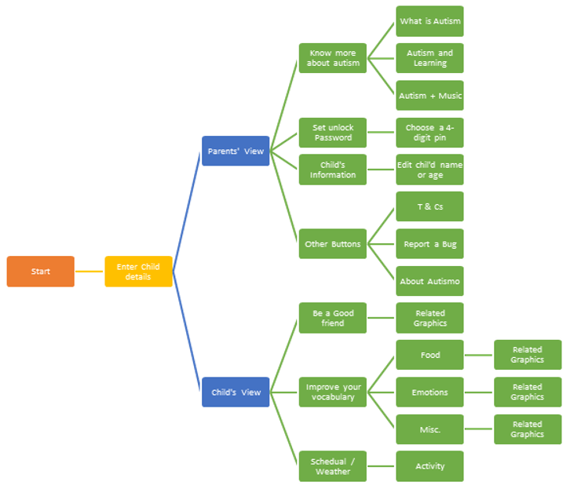

# Autismo
A learning application for autistic children. [Learn more about autism](https://en.wikipedia.org/wiki/Autism)

## PURPOSE 
The purpose of this public repository is to invite developers for collaboration to make this application worth using and let the people serve their nations for a noble cause.

---
## PROBLEM STATEMENT
Autistic children face a number of difficulties in learning basic concepts and communication. There is very little known advancement in the field of ICT in this field.

## SOLUTION
The solution is to develop an interactive mobile application specifically for autistic children and generally for all children who have basic knowledge of communication in English and have access to android enabled smart devices.

-----------
## DESIGN

## Softwares used
- Android Studio v3.0.1 
- Adobe Illustrator
- Microsoft Word 2013

## Languages and Frameworks
- Java
- Android SDK

------

## INSTALLATION AND RUN GUIDE

#### For users
1. Download the application from [Google Play Store](link)

#### For developers
1. hi

---
#### [GitHub Repository Link](https://github.com/uurehman/autismo-application)